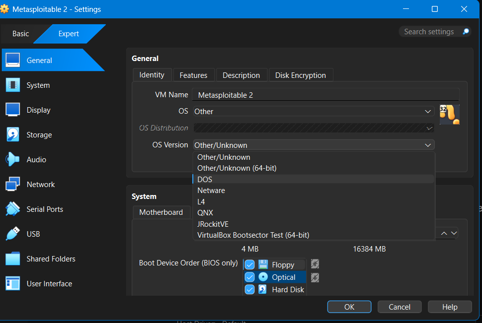
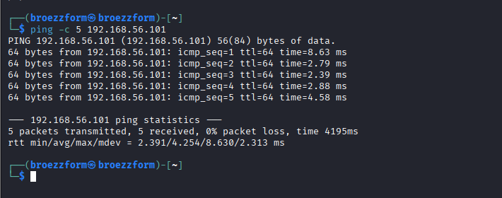
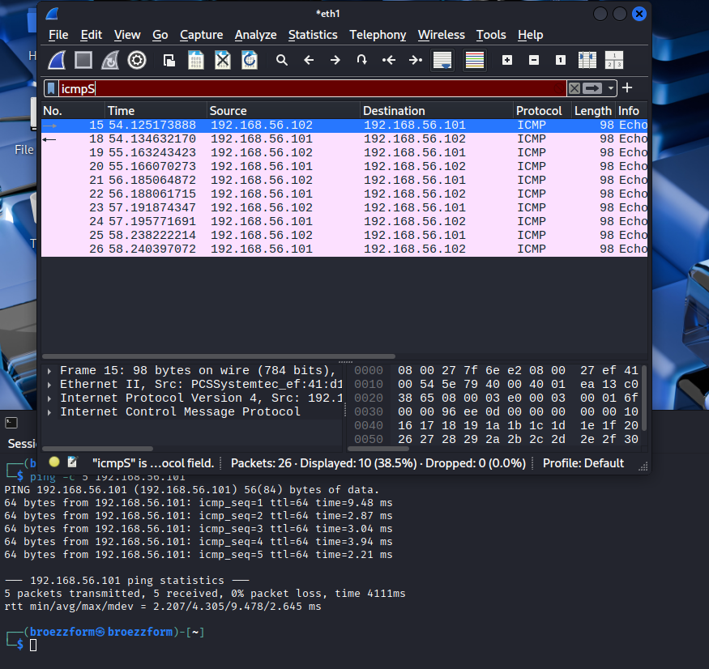

# Lab Setup Report

**Student Name:** Hemanth Varma
**Task:** 1 - Foundation & Environment Setup

---

## 1. Virtual Network Configuration
*Evidence that the Host-Only Adapter is configured correctly.*

## 2. Target Machine Setup (Metasploitable)
*Evidence of the victim machine running with a valid IP.*

## 3. Connectivity Proof
*Evidence that Kali can ping the target with 0% packet loss.*

## 4. Traffic Analysis
*Evidence of Wireshark capturing ICMP traffic on the private network.*

