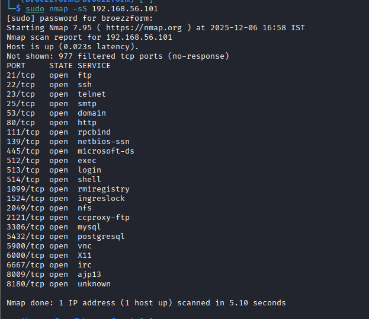
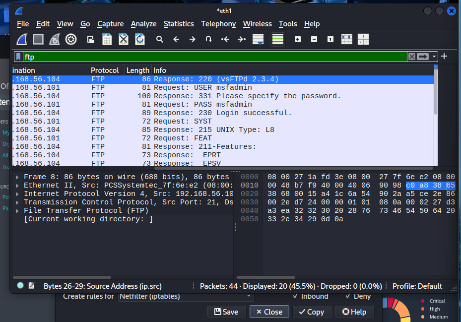
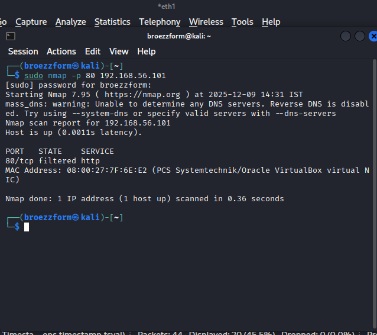

@'
# Task 2: Network Security & Scanning

**Internship Domain:** Cybersecurity & Ethical Hacking
**Task Duration:** Days 13-24

---

## 📌 Objective
To identify live hosts, open ports, and assess vulnerabilities on the target (Metasploitable 2).

---

## 📸 Evidence Screenshots

### 1. Nmap Scan Results
**Objective:** Identify open ports and service versions.

*(Note: Please ensure you renamed your screenshot to 'nmap_scan.png' inside the Evidence folder)*

### 2. Traffic Analysis (Wireshark)
**Objective:** Capture unencrypted FTP credentials.

*(Note: Please ensure you renamed your screenshot to 'wireshark.png')*

### 3. Firewall Blocking
**Objective:** Proof that Port 80 was blocked using IPTables.

*(Note: Please ensure you renamed your screenshot to 'firewall.png')*

---

## 📊 Vulnerability Report
The automated vulnerability assessment was conducted using Nessus Essentials.
- **[Click here to view the full PDF Report](Scan_Reports/Task2_Vulnerability_Scan_Report.pdf)**

---

## 🛡️ Mitigation Strategies
1. **Disable Telnet:** It transmits data in cleartext. Use SSH instead.
2. **Patch Services:** The vsftpd 2.3.4 version contains a known backdoor.
3. **Firewall:** Configure `iptables` to restrict access to management ports.
'@ | Out-File -FilePath "Task_2_Network_Scanning\README.md" -Encoding utf8