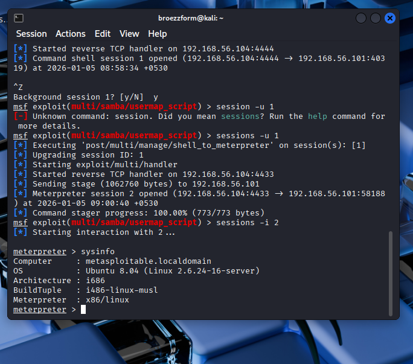
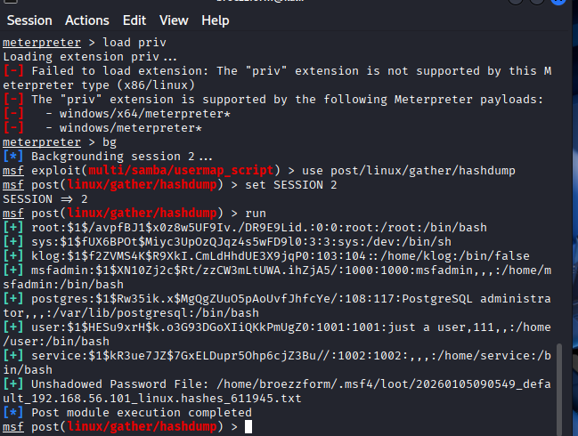
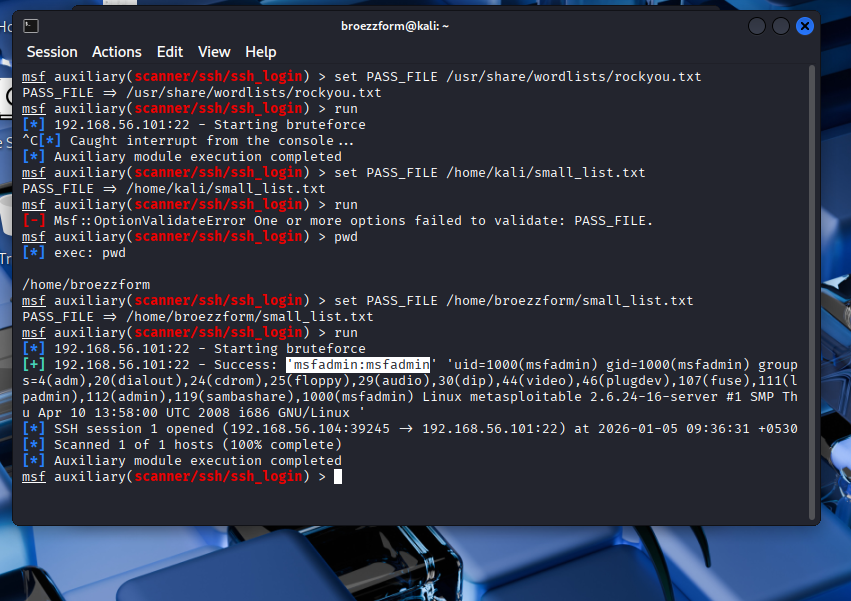
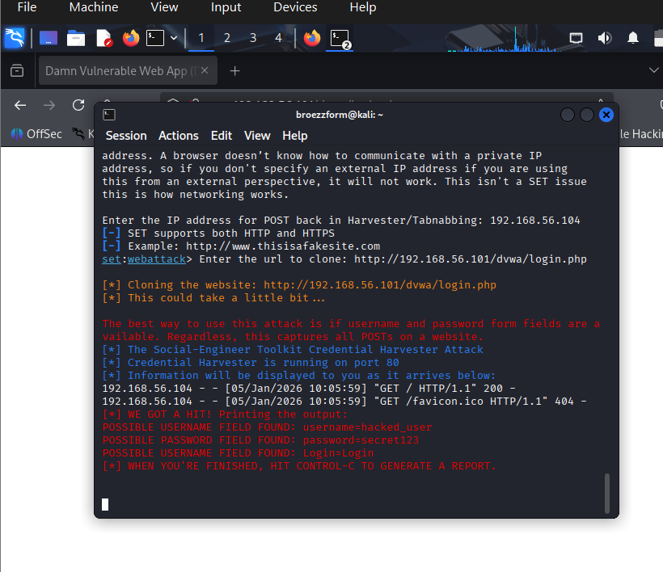
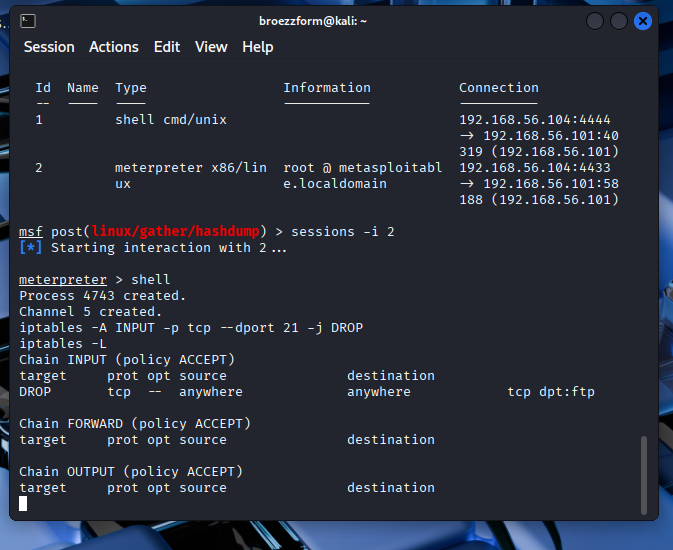

# ⚔️ Task 4: System Exploitation & Security Hardening

**Internship Domain:** Cybersecurity & Ethical Hacking
**Target System:** Metasploitable 2 (Linux)
**Tools Used:** Metasploit Framework, Hydra, John the Ripper, Social Engineering Toolkit (SET), iptables
**Date:** January 2026

---

## 📌 1. Penetration Testing Methodology
This assessment followed the industry-standard **PTES (Penetration Testing Execution Standard)** lifecycle:

1.  **Reconnaissance:** Gathering IP addresses and open ports (Completed in Task 2).
2.  **Exploitation:** Using identified vulnerabilities (Samba/vsftpd) to gain unauthorized access.
3.  **Post-Exploitation:** Maintaining access, privilege escalation, and data exfiltration (Hashdump).
4.  **Reporting:** Documenting findings and recommending remediation.

---

## 💥 2. System Exploitation (Metasploit)
**Objective:** Gain root access to the target server by exploiting a vulnerability in the Samba file-sharing service.

* **Vulnerability:** Samba "Usermap Script" (CVE-2007-2447).
* **Exploit Module:** `exploit/multi/samba/usermap_script`
* **Payload:** `cmd/unix/reverse_netcat` (upgraded to Meterpreter).

### Post-Exploitation Actions:
Once root access was achieved, we performed enumeration to extract system details and sensitive credential hashes.

**Evidence:**

*(Figure 1: Gaining a Meterpreter shell and verifying OS details via `sysinfo`)*

*(Figure 2: Extracting password hashes from `/etc/shadow` using the post-exploitation module)*

---

## 🔐 3. Password Attacks
**Objective:** Test the strength of user passwords using online and offline brute-force methods.

### A. Online Attack (Hydra)
We attempted to guess the SSH password for the user `msfadmin` using a dictionary attack.
* **Command:** `hydra -l msfadmin -P small_list.txt ssh://[Target-IP]`
* **Result:** Successfully identified credentials `msfadmin:msfadmin`.

### B. Offline Attack (John the Ripper)
We cracked the password hashes extracted during the Metasploit phase.
* **Algorithm:** MD5Crypt
* **Tool:** John the Ripper
* **Result:** The root password was cracked instantly due to weak complexity.

---

## 🎣 4. Social Engineering (Phishing Simulation)
**Objective:** Demonstrate how attackers harvest credentials using deceptive websites.

* **Tool:** Social Engineering Toolkit (SET).
* **Method:** Credential Harvester (Site Cloner).
* **Scenario:** A clone of the organization's login page (DVWA) was hosted on the attacker's machine. When the victim logged in, credentials were captured in plain text.

**Evidence:**

*(Figure 5: The fake login page hosted on the attacker's IP)*

*(Figure 6: Plaintext username and password captured by the tool)*

---

## 🛡️ 5. System Hardening (Mitigation)
After exploiting the system, we implemented defense measures to secure the vulnerabilities.

### Firewall Configuration (iptables)
We configured the Linux firewall to block traffic on unused or vulnerable ports (e.g., FTP Port 21).

* **Command:** `iptables -A INPUT -p tcp --dport 21 -j DROP`

**Evidence:**

*(Figure 7: Verification of the new DROP rule in the iptables chain)*

---

## 🦠 6. Malware Basics (Notes)
As part of the curriculum, we studied the fundamental types of malware analysis:

* **Static Analysis:** Analyzing malware without running it.
    * *Techniques:* Hashing (MD5/SHA256) to identify known threats, analyzing strings (ASCII/Unicode) to find IP addresses or filenames, and checking PE headers.
    * *Tools:* Strings, Ghidra, VirusTotal.
* **Dynamic Analysis:** Running malware in a controlled "Sandbox" to observe behavior.
    * *Techniques:* Monitoring registry changes, network connections (C2 traffic), and file system modifications.
    * *Tools:* Cuckoo Sandbox, Wireshark, Process Monitor.

---

## 📝 7. Remediation Recommendations
To secure the infrastructure against these attacks, the following actions are recommended:
1.  **Patch Management:** Update `Samba` and `vsftpd` to the latest stable versions to fix known CVEs.
2.  **Strong Password Policy:** Enforce complex passwords to prevent Dictionary/Brute-force attacks (e.g., minimum 12 characters, special symbols).
3.  **Disable Unused Services:** If FTP is not required, disable the service completely (`systemctl disable vsftpd`).
4.  **Network Segmentation:** Use firewalls to restrict access to management ports (SSH/22) to authorized IP addresses only.

---
*Report generated by Hemanth Varma*